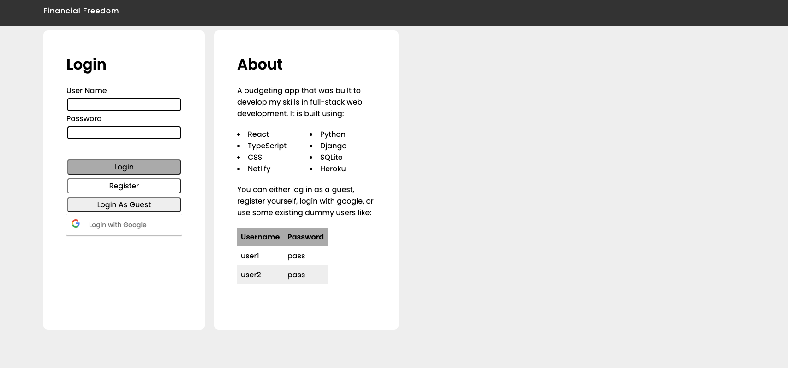
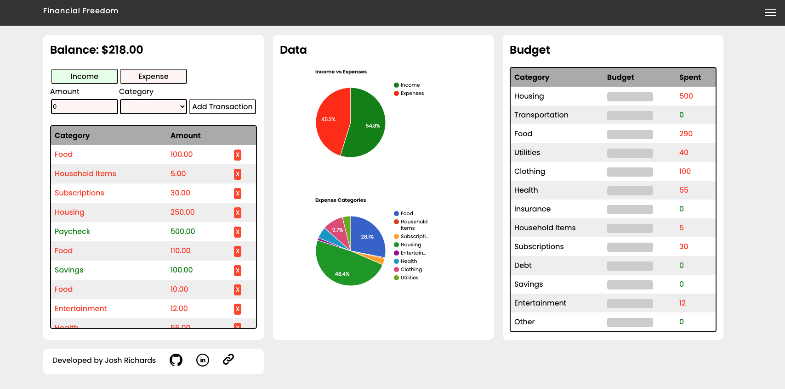
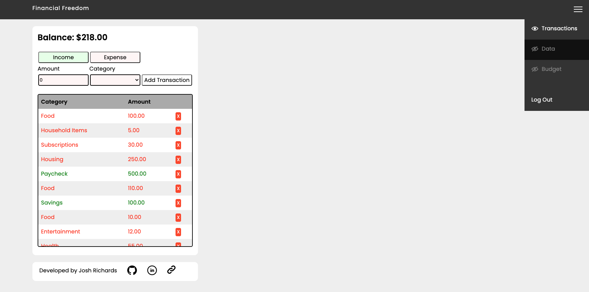

# Financial Freedom
A full stack budgeting application that manages users and their transactions.
Originally forked from [here](https://github.com/joshuarichards001/financial-freedom) for training purposes.

## Technologies

- **React** (for the frontend framework)
- **Typescript** (for the Javascript syntax)
- **CSS** (for the styling)
- **Python** (for the server side language)
- **Django** (for the server side framework)
- **SQLite** (for the database)

## Current Functionality

- Adding a transaction
- Deleting a transaction
- Showing your balance
- Pie Charts that show
  - Income vs Expenses
  - Expense Category Comparison
- A budget of what you want to spend on each category
- Hot swap sections to customise the user interface
- User support with login, logout and register functionality
- Storing users tokens locally to remove the need to login every time
- Can sign in using your Google Account

## Set-up on your Machine

1. Clone the project to your machine `[git clone git@github.com:TechUpSchool/student-project-financial-freedom.git]`
2. Navigate into the directory `[cd student-project-financial-freedom]`
3. Navigate into the backend directory `[cd backend]`
4. Install virtualenv if you haven't already `[pip install virtualenv]` (You might need to use pip3)
5. Create the virtual environment `[virtualenv env]`
6. Activate the virtual environment `[source env/bin/activate]`
7. Install the dependencies `[pip install -r requirements.txt]`
8. Navigate into the frontend directory `[cd ../frontend]`
9. Install the dependencies `[npm install]`

Then to run this application you will need to perform the following in two separate terminals:

1. In the first terminal go into backend `[cd backend]` and run `[python3 manage.py runserver]`
2. In the second terminal go into frontend `[cd frontend]` and run `[npm start]`

## Set-up Database

1. Create auth_user table in database by running `[python3 manage.py migrate]`
2. Create Super user by running `[python3 manage.py createsuperuser]`
3. Username: admin
4. Email address: `[enter your email address]`
5. Password: `[admin1234]`

## Add Users to the database
### User 1
1. run `[python3 manage.py runserver]`
2. Navigate to `[http://127.0.0.1:8000/admin/]`
3. Enter username: `[admin]`
4. Enter Password: `[admin1234]`
5. Navigate to AUTHENTICATION AND AUTHORISATION
6. Go to Users and click `[add]`
7. On Username enter `[user1]`
8. On Password enter `[pass]`
9. Click Save button

### User 2
1. On Username enter `[user2]`
2. On Password enter `[pass]`
3. Click Save button

# After following above instructions, you will ready to login

## Application in Action

Here is the login page that a new user is greeted with.

Here is the dashboard that is the core page of the application

A showcase of the "Hot swap sections" functionality

